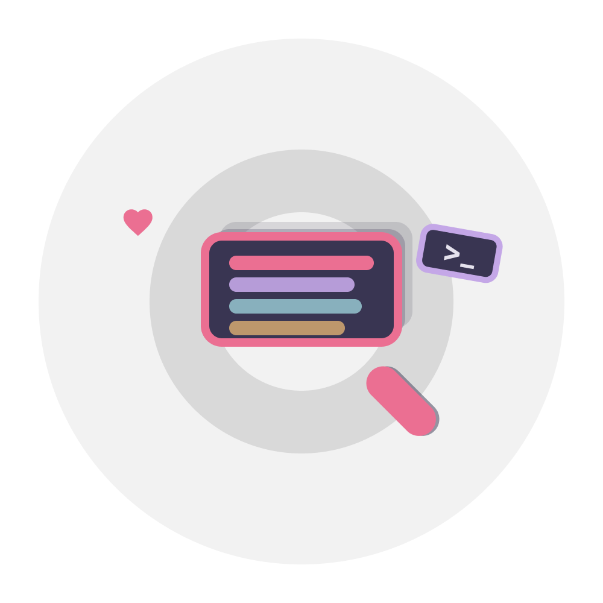

# Quetty
<div align="center">

[](https://www.rust-lang.org/)
[](https://azure.microsoft.com/en-us/products/service-bus)
[](#)
[](https://github.com/ratatui-org/ratatui)
[](https://opensource.org/licenses/MIT)

</div>

A powerful terminal-based Azure Service Bus queue manager that provides an intuitive interface for viewing, managing, and interacting with message queues efficiently.


<div align="center">
  
</div>
<div align="center">
  
</div>

## Table of Contents

- [Overview](#overview)
- [Key Features](#key-features)
- [Quick Start](#quick-start)
- [Development](#development)
- [Documentation](#documentation)
- [Roadmap](#roadmap)
- [Acknowledgments](#acknowledgments)
- [License](#license)

## Overview
Quetty combines the power of Azure Service Bus with a sleek terminal interface, making queue management accessible and efficient. Whether you're debugging message flows, managing dead letter queues, or performing bulk operations, Quetty provides the tools you need in a fast, keyboard-driven environment.


## Key Features

### 🔍 **Message Management**
- **Smart Preview**: Automatically previews messages with syntax highlighting
- **Efficient Pagination**: Browse large queues with intelligent caching
- **Bulk Operations**: Delete, send, or manage multiple messages at once
- **Message Editing**: Edit and resend messages directly from the interface

### 🔄 **Dead Letter Queue Support**
- **Seamless DLQ Navigation**: Switch between main and dead letter queues
- **Message Recovery**: Resend messages from DLQ back to main queue
- **Bulk DLQ Operations**: Handle multiple messages efficiently

### 🎯 **Azure Integration**
- **Multiple Auth Methods**: Device code, client credentials, connection strings
- **Azure Discovery**: Automatically discover subscriptions, resource groups, and namespaces
- **Queue Statistics**: Real-time queue metrics and health monitoring

### 🎨 **User Experience**
- **Intuitive Interface**: Keyboard-driven navigation with vim-like shortcuts
- **Customizable Themes**: Built-in themes (Catppuccin, Nightfox, Quetty) with custom theme support
- **Real-time Updates**: Instant feedback with smart state management
- **Comprehensive Help**: Context-aware help system

## Quick Start

### Prerequisites
- [Rust](https://rustup.rs/) (latest stable version)
- Azure Service Bus namespace with appropriate permissions

### Installation
```bash
git clone https://github.com/yourusername/quetty.git
cd quetty
cargo build --release
```

### First Run
```bash
cd ui
cargo run
```

On first launch, Quetty will guide you through the configuration process. For detailed setup instructions, see [INSTALLATION.md](docs/INSTALLATION.md).

### Basic Usage
1. **Configure Authentication**: Set up Azure AD or connection string authentication
2. **Select Namespace**: Choose your Service Bus namespace
3. **Pick a Queue**: Select the queue you want to manage
4. **Start Managing**: Use keyboard shortcuts to navigate and manage messages

> 💡 **Tip**: Press `h` at any time to see available keyboard shortcuts and help.

## Development

For development setup and contribution guidelines, see [CONTRIBUTING.md](docs/CONTRIBUTING.md).

### Project Structure
- `ui/` - Terminal user interface (main application)
- `server/` - Core library for Azure Service Bus integration
- `themes/` - Built-in themes and theme definitions

## Documentation

- **[Installation Guide](docs/INSTALLATION.md)** - Detailed setup and configuration
- **[Authentication Guide](docs/AUTHENTICATION.md)** - Azure AD and connection string setup
- **[User Guide](docs/USER_GUIDE.md)** - Complete feature walkthrough and usage
- **[Configuration Reference](docs/CONFIGURATION.md)** - Complete config.toml documentation
- **[Theming Guide](docs/THEMING.md)** - Create and customize themes
- **[Traffic Simulator](docs/TRAFFIC_SIMULATOR.md)** - Standalone testing tool for queue load simulation
- **[Troubleshooting](docs/TROUBLESHOOTING.md)** - Common issues and solutions
- **[Contributing](docs/CONTRIBUTING.md)** - Development and contribution guidelines

## Roadmap

### Upcoming Features
- **Binary Releases**: Pre-built binaries for major platforms
- **Enhanced Bulk Operations**: Improved performance for large-scale operations
- **Message Templates**: Save and reuse common message patterns
- **Topic Support**: Full Azure Service Bus Topics and Subscriptions support
- **Advanced Filtering**: Search and filter messages by content, properties, and metadata

### Recent Additions
- ✅ **Complete Authentication Suite**: Device code, client credentials, connection strings
- ✅ **Bulk Operations**: Multi-message delete, DLQ, and resend operations
- ✅ **Theme System**: Customizable themes with built-in theme packs
- ✅ **Message Editing**: Edit and resend messages with validation
- ✅ **Azure Discovery**: Automatic resource discovery and selection

## Acknowledgments

Quetty is built on the shoulders of amazing open-source projects:

- **[Ratatui](https://github.com/ratatui-org/ratatui)** - A powerful Rust library for building rich terminal user interfaces
- **[tui-realm](https://github.com/veeso/tui-realm)** - An excellent framework for building stateful TUI applications
- **[Tokio](https://tokio.rs/)** - The asynchronous runtime for Rust
- **[Azure SDK for Rust](https://github.com/Azure/azure-sdk-for-rust)** - Azure service integrations

Special thanks to the maintainers and contributors of these projects for making terminal-based applications in Rust both powerful and enjoyable to develop.

## License
This project is licensed under the MIT License - see the [LICENSE](LICENSE) file for details.
