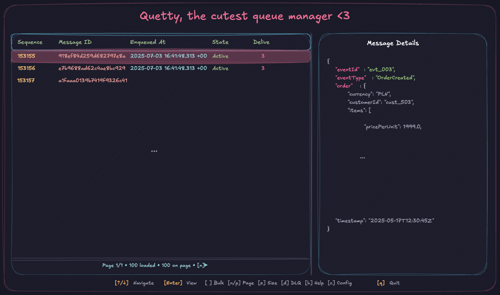

# Quetty
<div align="center">

[](https://www.rust-lang.org/)
[](https://azure.microsoft.com/en-us/products/service-bus)
[](#)
[](https://github.com/ratatui-org/ratatui)
[](https://opensource.org/licenses/MIT)

</div>

A powerful terminal-based Azure Service Bus queue manager that provides an intuitive interface for viewing, managing, and interacting with message queues efficiently.


<div align="center">
  
</div>
<div align="center">
  
</div>

## Table of Contents

- [Overview](#overview)
- [Interface Preview](#interface-preview)
- [Key Features](#key-features)
- [Quick Start](#quick-start)
- [Development](#development)
- [Documentation](#documentation)
- [Roadmap](#roadmap)
- [Acknowledgments](#acknowledgments)
- [License](#license)

## Overview
Quetty combines the power of Azure Service Bus with a sleek terminal interface, making queue management accessible and efficient. Whether you're debugging message flows, managing dead letter queues, or performing bulk operations, Quetty provides the tools you need in a fast, keyboard-driven environment.

## 🚧 Development Phase

**Quetty is currently in Alpha**

We are actively developing and testing Quetty to ensure it meets production standards. During this phase, we're focusing on:

- ✅ **Performance & UI Testing**: Verifying optimal performance across different environments and platforms. | Tested on most common terminal emulators (Ghostty *recomended*, WezTerm, ITerm2, Warp, macOS defaul Terminal *not recomended*).
- ✅ **Nightly Builds**: Automated nightly builds available for all major platforms (Linux, Windows, macOS)
- ✅ **Installation Methods**: Multiple installation options including nightly builds and source compilation
- ⏳ **Configuration System**: Implementing a fully working configuration system with easy setup for binary installations
- ⏳ **Action Verification**: Adding deep verification for destructive operations (like delete actions) to prevent accidental data loss

While Quetty is functional and actively used in development environments, please exercise caution when using it in production scenarios. We recommend thorough testing in your specific environment before deploying to production systems.

### 🧪 Alpha/Beta Participation

Want to participate in alpha/beta testing? We'd love your feedback! Contact us via:

- **GitHub Issues**: [Open an issue](https://github.com/yourusername/quetty/issues) for bug reports and feature requests
- **Email**: pereiradawid@outlook.com
- **LinkedIn**: [www.linkedin.com/in/pereiradawid](https://www.linkedin.com/in/pereiradawid)

Your testing and feedback help us build a better tool for the entire Azure Service Bus community.

## Interface Preview

Experience Azure Service Bus management through Quetty's intuitive terminal interface.

<div align="center">
  
  <p><em>Quetty's clean and efficient terminal user interface</em></p>
</div>

### 🎥 Live Demo

See Quetty in action with this interactive demo showcasing core features:

https://github.com/user-attachments/assets/cd714f56-6b90-4c01-ae30-d915cd959bd4
<div align="center">
  <a href="https://github.com/user-attachments/assets/cd714f56-6b90-4c01-ae30-d915cd959bd4">
  </a>
  <p><em>Click to watch Quetty's key features in action: authentication, queue management, and message operations</em></p>
</div>

## Key Features

### 🔍 **Message Management**
- **Smart Preview**: Automatically previews messages with syntax highlighting
- **Efficient Pagination**: Browse large queues with intelligent caching
- **Bulk Operations**: Delete, send, or manage multiple messages at once
- **Message Editing**: Edit and resend messages directly from the interface

### 🔄 **Dead Letter Queue Support**
- **Seamless DLQ Navigation**: Switch between main and dead letter queues
- **Message Recovery**: Resend messages from DLQ back to main queue
- **Bulk DLQ Operations**: Handle multiple messages efficiently

### 🎯 **Azure Integration**
- **Multiple Auth Methods**: Device code, client credentials, connection strings
- **Azure Discovery**: Automatically discover subscriptions, resource groups, and namespaces
- **Queue Statistics**: Real-time queue metrics and health monitoring

### 📁 **Profile Management**
- **Multi-Environment Support**: Separate profiles for dev, staging, production
- **Profile Switching**: Quick environment switching with `--profile` flag
- **Secure Isolation**: Each profile has isolated configuration and credentials
- **Easy Setup**: Interactive setup wizard for each environment

### 🎨 **User Experience**
- **Intuitive Interface**: Keyboard-driven navigation with vim-like shortcuts
- **Customizable Themes**: Built-in themes (Catppuccin, Nightfox, Quetty) with custom theme support
- **Real-time Updates**: Instant feedback with smart state management
- **Comprehensive Help**: Context-aware help system

## Quick Start

### Prerequisites
- [Rust](https://rustup.rs/) (latest stable version)
- Azure Service Bus namespace with appropriate permissions

### Installation

#### Option 1: Nightly Builds 🌙 (Recommended for Testing)
For the latest development features and fastest access:

**Download:** https://github.com/dawidpereira/quetty/releases/tag/nightly-latest

- **Linux x64**: `quetty-nightly-linux-x64-{version}.tar.gz`
- **Windows x64**: `quetty-nightly-windows-x64-{version}.zip`
- **macOS x64**: `quetty-nightly-macos-x64-{version}.tar.gz`
- **macOS ARM64**: `quetty-nightly-macos-arm64-{version}.tar.gz`

```bash
# Example for Linux/macOS
wget https://github.com/dawidpereira/quetty/releases/download/nightly-latest/quetty-nightly-linux-x64-{version}.tar.gz
tar -xzf quetty-nightly-linux-x64-{version}.tar.gz
chmod +x quetty-nightly-linux-x64
./quetty-nightly-linux-x64
```

⚠️ **Warning**: Nightly builds may be unstable and are not recommended for production use.

#### Option 2: Build from Source
```bash
git clone https://github.com/dawidpereira/quetty.git
cd quetty
cargo build --release
```

#### Option 3: Add to Shell PATH (Recommended)
After building or downloading, add quetty to your system PATH:
```bash
# Copy binary to local bin directory
cp target/release/quetty ~/.local/bin/
# Or add to system PATH
export PATH="$PWD/target/release:$PATH"
```

### First Run

#### Interactive Setup (Recommended)
```bash
# Run the setup wizard
quetty --setup

# For specific environments, use profiles
quetty --profile dev --setup      # Development environment
quetty --profile prod --setup     # Production environment
```

#### Quick Start
```bash
# Default profile
quetty

# Specific profile
quetty --profile dev
quetty --profile staging
quetty --profile prod
```

On first launch, Quetty will guide you through the configuration process. For detailed setup instructions, see [INSTALLATION.md](docs/INSTALLATION.md).

### Basic Usage
1. **Configure Authentication**: Set up Azure AD or connection string authentication
2. **Select Namespace**: Choose your Service Bus namespace
3. **Pick a Queue**: Select the queue you want to manage
4. **Start Managing**: Use keyboard shortcuts to navigate and manage messages

> 💡 **Tip**: Press `h` at any time to see available keyboard shortcuts and help.

### Profile Management
Quetty supports multiple profiles for different environments:

```bash
# Create profiles for different environments
quetty --profile dev --setup       # Development environment
quetty --profile staging --setup   # Staging environment
quetty --profile prod --setup      # Production environment

# Switch between environments
quetty --profile dev              # Use development profile
quetty --profile prod             # Use production profile
quetty                           # Use default profile

# Show configuration directory
quetty --config-dir              # Shows ~/.config/quetty

# Use custom config file
quetty --config ./my-config.toml # Custom configuration
```

## Development

For development setup and contribution guidelines, see [CONTRIBUTING.md](docs/CONTRIBUTING.md).

### Project Structure
- `ui/` - Terminal user interface (main application)
- `server/` - Core library for Azure Service Bus integration
- `themes/` - Built-in themes and theme definitions

## Documentation

### Getting Started
- **[Installation Guide](docs/INSTALLATION.md)** - Setup, profiles, and first-time configuration
- **[User Guide](docs/USER_GUIDE.md)** - Interface usage and message management

### Reference
- **[CLI Reference](docs/CLI_REFERENCE.md)** - Complete command-line options
- **[Configuration Reference](docs/CONFIGURATION.md)** - All configuration and authentication options

### Additional Resources
- **[Troubleshooting](docs/TROUBLESHOOTING.md)** - Common issues and solutions
- **[Contributing](docs/CONTRIBUTING.md)** - Development and contribution guidelines

## Roadmap

### Upcoming Features
- **Binary Releases**: Pre-built binaries for major platforms
- **Enhanced Bulk Operations**: Improved performance for large-scale operations
- **Message Templates**: Save and reuse common message patterns
- **Topic Support**: Full Azure Service Bus Topics and Subscriptions support
- **Advanced Filtering**: Search and filter messages by content, properties, and metadata

### Recent Additions
- ✅ **Profile-Based Configuration**: Multi-environment support with isolated settings
- ✅ **Enhanced Security**: Path traversal protection and input validation
- ✅ **Performance Optimization**: Intelligent caching and reduced filesystem operations
- ✅ **Complete Authentication Suite**: Device code, client credentials, connection strings
- ✅ **Bulk Operations**: Multi-message delete, DLQ, and resend operations
- ✅ **Theme System**: Customizable themes with built-in theme packs
- ✅ **Message Editing**: Edit and resend messages with validation
- ✅ **Azure Discovery**: Automatic resource discovery and selection

## Acknowledgments

Quetty is built on the shoulders of amazing open-source projects:

- **[Ratatui](https://github.com/ratatui-org/ratatui)** - A powerful Rust library for building rich terminal user interfaces
- **[tui-realm](https://github.com/veeso/tui-realm)** - An excellent framework for building stateful TUI applications
- **[Tokio](https://tokio.rs/)** - The asynchronous runtime for Rust
- **[Azure SDK for Rust](https://github.com/Azure/azure-sdk-for-rust)** - Azure service integrations

Special thanks to the maintainers and contributors of these projects for making terminal-based applications in Rust both powerful and enjoyable to develop.

## License
This project is licensed under the MIT License - see the [LICENSE](LICENSE) file for details.
